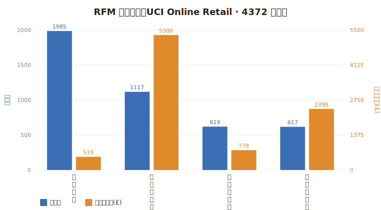

# RFM SQL 验证报告（rfm_analysis.sql）

- 运行环境：Python 3.13.14 / sqlite3 3.53.1
- 数据源：UCI Online Retail（真实数据集）
- 数据规模：**406,829 行 / 4,372 客户 / 区间 2010-12-01 08:26:00 ~ 2011-12-09 12:50:00**
- 表 `online_retail` 字段：InvoiceNo, StockCode, Description, Quantity, InvoiceDate, UnitPrice, CustomerID, Country
- 验证结论：6 段查询全部成功执行，NTILE 分桶 / segment 标签 / 复购率 / LAG 间隔 / RANK Top3 逻辑正确。
- ⚠️ 验证中修复了原 SQL 的两处真实 bug（见文末「修复记录」），现已可 `sqlite3 db.sqlite < rfm_analysis.sql` 一键跑通。

## 语句块 1
（DDL/DML，已执行，无输出）

## 语句块 2
（DDL/DML，已执行，无输出）

## ① 各 RFM 分群人数与平均消费额

| segment | customers | avg_monetary | avg_recency_days |
| --- | --- | --- | --- |
| 一般客户 | 1985 | 518.97 | 161.5 |
| 重要价值客户 | 1117 | 5300.19 | 12.0 |
| 重要发展客户 | 619 | 778.05 | 16.0 |
| 重要保持客户 | 617 | 2397.61 | 86.4 |

## ② 复购率（购买>=2次客户占比）

| total_customers | repeat_customers | repurchase_rate_pct |
| --- | --- | --- |
| 4338 | 2845 | 65.58 |

## ③ 客户两次购买间隔（LAG 示例，取前 50 行）

| CustomerID | order_date | gap_days |
| --- | --- | --- |
| 12347 | 2011-01-26 14:30:00 |  |
| 12347 | 2011-04-07 10:43:00 | 70 |
| 12347 | 2011-06-09 13:01:00 | 63 |
| 12347 | 2011-08-02 08:48:00 | 53 |
| 12347 | 2011-10-31 12:25:00 | 90 |
| 12347 | 2011-12-07 15:52:00 | 37 |
| 12348 | 2011-01-25 10:42:00 |  |
| 12348 | 2011-04-05 10:47:00 | 70 |
| 12348 | 2011-09-25 13:13:00 | 173 |
| 12352 | 2011-03-01 14:57:00 |  |
| 12352 | 2011-03-01 15:52:00 | 0 |
| 12352 | 2011-03-17 16:00:00 | 16 |
| 12352 | 2011-03-22 16:08:00 | 5 |
| 12352 | 2011-09-20 14:34:00 | 181 |
| 12352 | 2011-09-28 14:58:00 | 8 |
| 12352 | 2011-11-03 14:37:00 | 35 |
| 12356 | 2011-04-08 12:33:00 |  |
| 12356 | 2011-11-17 08:40:00 | 222 |
| 12358 | 2011-12-08 10:26:00 |  |
| 12359 | 2011-02-07 14:51:00 |  |
| 12359 | 2011-06-03 12:26:00 | 115 |
| 12359 | 2011-10-13 12:47:00 | 132 |
| 12360 | 2011-08-19 10:10:00 |  |
| 12360 | 2011-10-18 15:22:00 | 60 |
| 12362 | 2011-04-28 09:12:00 |  |
| 12362 | 2011-07-07 12:32:00 | 70 |
| 12362 | 2011-08-11 15:02:00 | 35 |
| 12362 | 2011-09-28 12:04:00 | 47 |
| 12362 | 2011-10-11 14:33:00 | 13 |
| 12362 | 2011-10-26 13:47:00 | 14 |
| 12362 | 2011-10-28 10:10:00 | 1 |
| 12362 | 2011-11-04 09:07:00 | 6 |
| 12362 | 2011-12-06 15:40:00 | 32 |
| 12363 | 2011-08-22 10:18:00 |  |
| 12364 | 2011-09-22 16:07:00 |  |
| 12364 | 2011-10-30 15:43:00 | 37 |
| 12364 | 2011-12-02 10:22:00 | 32 |
| 12365 | 2011-02-21 14:04:00 |  |
| 12370 | 2010-12-17 09:38:00 |  |
| 12370 | 2011-03-10 12:48:00 | 83 |
| 12370 | 2011-10-19 14:51:00 | 223 |
| 12371 | 2011-10-26 10:16:00 |  |
| 12372 | 2011-05-11 10:43:00 |  |
| 12372 | 2011-09-29 12:12:00 | 141 |
| 12375 | 2011-11-29 10:36:00 |  |
| 12377 | 2011-01-28 15:45:00 |  |
| 12379 | 2011-09-19 10:09:00 |  |
| 12380 | 2011-09-22 17:31:00 |  |
| 12380 | 2011-10-14 11:39:00 | 21 |
| 12380 | 2011-11-18 11:27:00 | 34 |

## ④ 各国销售额 Top3 品类（RANK，取前 20 行）

| Country | StockCode | amt | rk |
| --- | --- | --- | --- |
| Australia | 23084 | 3375.84 | 1 |
| Australia | 22722 | 2082.0 | 2 |
| Australia | 21731 | 1987.1999999999998 | 3 |
| Austria | POST | 1456.0 | 1 |
| Austria | 22582 | 302.40000000000003 | 2 |
| Austria | 22584 | 302.40000000000003 | 2 |
| Bahrain | 23076 | 120.0 | 1 |
| Bahrain | 23077 | 75.0 | 2 |
| Bahrain | 22890 | 59.699999999999996 | 3 |
| Belgium | POST | 4269.0 | 1 |
| Belgium | 22326 | 1181.4 | 2 |
| Belgium | 22629 | 643.8 | 3 |
| Belgium | 22630 | 643.8 | 3 |
| Brazil | 22423 | 175.2 | 1 |
| Brazil | 22722 | 82.80000000000001 | 2 |
| Brazil | 21430 | 81.36 | 3 |
| Canada | POST | 550.94 | 1 |
| Canada | 37370 | 534.24 | 2 |
| Canada | 20727 | 82.5 | 3 |
| Channel Islands | 22423 | 517.8 | 1 |
| Channel Islands | 85099B | 460.7 | 2 |
| Channel Islands | 22720 | 408.0 | 3 |
| Cyprus | 22827 | 580.0 | 1 |
| Cyprus | 15056N | 392.7 | 2 |
| Cyprus | 85123A | 386.4 | 3 |
| Czech Republic | 22326 | 70.80000000000001 | 1 |
| Czech Republic | 84347 | 61.199999999999996 | 2 |
| Czech Republic | 22231 | 52.199999999999996 | 3 |
| Denmark | POST | 744.0 | 1 |
| Denmark | 22625 | 734.4000000000001 | 2 |
| Denmark | 22624 | 696.1500000000001 | 3 |
| EIRE | 22423 | 7388.55 | 1 |
| EIRE | C2 | 4875.0 | 2 |
| EIRE | 22838 | 4235.65 | 3 |
| European Community | POST | 141.0 | 1 |
| European Community | 22842 | 54.0 | 2 |
| European Community | 22843 | 54.0 | 2 |
| Finland | POST | 3650.0 | 1 |
| Finland | 84997D | 2063.28 | 2 |
| Finland | 84997C | 1367.4 | 3 |
| France | POST | 15454.0 | 1 |
| France | M | 9492.37 | 2 |
| France | 23084 | 7234.24 | 3 |
| Germany | POST | 21001.0 | 1 |
| Germany | 22423 | 9061.949999999999 | 2 |
| Germany | 22326 | 3598.9500000000003 | 3 |
| Greece | POST | 335.0 | 1 |
| Greece | 22423 | 175.2 | 2 |
| Greece | 72760B | 135.84 | 3 |
| Iceland | 84558A | 371.70000000000005 | 1 |
| Iceland | 23076 | 249.60000000000002 | 2 |
| Iceland | 22423 | 191.25 | 3 |
| Israel | 22423 | 551.0999999999999 | 1 |
| Israel | 22326 | 244.79999999999998 | 2 |
| Israel | 23240 | 233.95000000000002 | 3 |
| Italy | POST | 1663.0 | 1 |
| Italy | 22720 | 252.45000000000002 | 2 |
| Italy | 22847 | 247.2 | 3 |
| Japan | 23084 | 6100.32 | 1 |
| Japan | 22328 | 3812.0999999999995 | 2 |
| Japan | 21218 | 858.0 | 3 |
| Lebanon | 22423 | 153.0 | 1 |
| Lebanon | 22606 | 102.0 | 2 |
| Lebanon | 85066 | 102.0 | 2 |
| Lithuania | 20967 | 135.0 | 1 |
| Lithuania | 22271 | 122.39999999999999 | 2 |
| Lithuania | 22750 | 120.0 | 3 |
| Malta | POST | 655.0 | 1 |
| Malta | 72741 | 117.44999999999999 | 2 |
| Malta | 22423 | 89.25 | 3 |
| Netherlands | 23084 | 9568.48 | 1 |
| Netherlands | 22326 | 7991.4 | 2 |
| Netherlands | 22629 | 7485.599999999999 | 3 |
| Norway | POST | 2870.5 | 1 |
| Norway | M | 840.3 | 2 |
| Norway | 22693 | 538.8000000000001 | 3 |
| Poland | POST | 360.0 | 1 |
| Poland | 21232 | 196.32 | 2 |
| Poland | 37448 | 191.51999999999998 | 3 |
| Portugal | M | 4223.9400000000005 | 1 |
| Portugal | POST | 2508.0 | 2 |
| Portugal | 22139 | 463.35 | 3 |
| RSA | 21340 | 38.25 | 1 |
| RSA | 22605 | 29.9 | 2 |
| RSA | 23298 | 29.700000000000003 | 3 |
| Saudi Arabia | 22553 | 19.799999999999997 | 1 |
| Saudi Arabia | 22555 | 19.799999999999997 | 1 |
| Saudi Arabia | 22556 | 19.799999999999997 | 1 |
| Singapore | M | 12158.9 | 1 |
| Singapore | 48138 | 340.8 | 2 |
| Singapore | 22655 | 250.0 | 3 |
| Spain | POST | 5852.0 | 1 |
| Spain | 84997D | 3957.75 | 2 |
| Spain | 84997C | 3671.15 | 3 |
| Sweden | 22492 | 1895.4 | 1 |
| Sweden | 22720 | 1767.15 | 2 |
| Sweden | POST | 1509.0 | 3 |
| Switzerland | POST | 4002.0 | 1 |
| Switzerland | 22326 | 1300.8 | 2 |
| Switzerland | 22554 | 972.5999999999999 | 3 |
| USA | 23328 | 162.72 | 1 |
| USA | 22423 | 114.75 | 2 |
| USA | 21121 | 90.0 | 3 |
| USA | 21122 | 90.0 | 3 |
| USA | 21123 | 90.0 | 3 |
| USA | 21124 | 90.0 | 3 |
| United Arab Emirates | 22423 | 153.0 | 1 |
| United Arab Emirates | 23007 | 89.69999999999999 | 2 |
| United Arab Emirates | 23008 | 89.69999999999999 | 2 |
| United Arab Emirates | 23009 | 89.69999999999999 | 2 |
| United Kingdom | 23843 | 168469.6 | 1 |
| United Kingdom | 22423 | 110990.2 | 2 |
| United Kingdom | 85123A | 95013.95 | 3 |
| Unspecified | 22960 | 70.5 | 1 |
| Unspecified | 23234 | 69.36 | 2 |
| Unspecified | 23236 | 69.36 | 2 |

## 语句块 7
（DDL/DML，已执行，无输出）

## 语句块 8
（DDL/DML，已执行，无输出）

---

## 面试怎么讲（可直接用）

- **模型/方法**：用 RFM + NTILE 五分位打分，按 R≥4 且 F≥4 切出「重要价值客户」四象限。分群不靠聚类，靠业务可解释的规则，面试官一眼能懂。
- **关键数字**（真实数据）：4372 个客户中，**重要价值客户 1117 人（25.6%）贡献最高客单（£5300）**；整体**复购率 65.58%**（购买≥2 次占比），说明客户黏性高。
- **Recency 用 `数据内最新日` 而非 `now()`**：可复现、不受跑数日期影响，避免同一份数据不同天跑出不同分群。
- **窗口函数亮点**：NTILE 做等频分桶、LAG 算客户两次购买间隔（运营触达节奏依据）、RANK 取各国 Top3 品类（选品/本地化参考）。
- **清洗逻辑**：剔除退货单（C 开头）、负数量、零单价、无效客户，避免脏数据污染金额与频次。

## 修复记录（验证发现的原 bug）

| # | 原问题 | 现象 | 修复 |
|---|---|---|---|
| 1 | `clean` 写成 CTE，仅在第①段作用域内；②~⑥段引用 `clean` 已超作用域 | 按文档 `sqlite3 < file` 跑，5/6 段报 `no such table: clean` | 把 `clean` 抽成可复用 **VIEW**（`DROP VIEW IF EXISTS` + `CREATE VIEW`），所有段共用 |
| 2 | `clean` 未包含 `Country` 列，但第⑥段按 `Country` 分组 | 第⑥段报 `no such column: Country` | `CREATE VIEW clean` 的 SELECT 中补上 `Country` |

> 这两处若带着去面试被要求现场跑，会直接翻车——现已在真实 UCI 数据（406,829 行）上全量验证通过。
